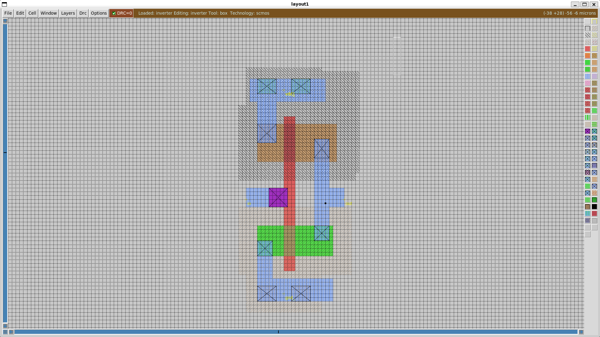
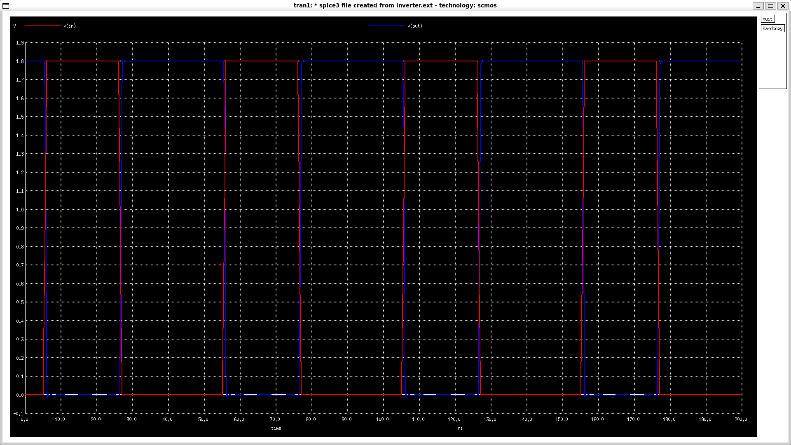

# CMOS Inverter Design and Simulation — Magic VLSI + ngspice

## Overview

<table>
  <tr>
    <td align="center">
      <br>
      <b>MAGIC LAYOUT</b>
    </td>
    <td align="center">
      <br>
      <b>NGSPICE PLOT</b>
    </td>
  </tr>
</table>


This repository documents the design of a **CMOS inverter** using the **Magic VLSI layout editor** with the **SCMOS technology file**, followed by extraction and simulation using **ngspice**.

Flow:
**Layout (Magic) → Extraction (.ext) → SPICE netlist (.spice) → Wrapper (.spice with sources & control) → Transient Simulation (ngspice).**

---

## Tools

* [Magic VLSI](http://opencircuitdesign.com/magic/) — layout editor, DRC, and extraction.
* [ngspice](http://ngspice.sourceforge.net/) — circuit-level simulation.
* SCMOS technology file — defines layers, design rules, and extraction rules.

---

## SCMOS Technology

* **NMOS** devices are built directly in the **p-type substrate** using **n-diffusion**.
* **PMOS** devices are placed in an **n-well**, using **p-diffusion**.
* **Poly** crossing diffusion defines the MOSFET gate.
* **Metal1** interconnect provides routing for input/output/power.
* **Contacts** connect different layers (poly–metal, diffusion–metal, substrate/well taps).
* **Body connections**:

  * NMOS body tied to substrate → GND.
  * PMOS body tied to n-well → VDD.

This ensures junctions are reverse-biased and avoids latch-up.

---

## Layout Steps (Magic)

1. Start Magic with SCMOS:

   ```bash
   magic -T scmos &
   ```

2. Draw the inverter:

   * **PMOS**: inside `nwell`, create `pdiff` for source/drain.
   * **NMOS**: outside the nwell, create `ndiff`.
   * **Poly**: draw crossing both diffusions (forms gates).
   * **Metal1**:

     * connect to poly (input node, `in`),
     * connect drains of NMOS & PMOS (output node, `out`),
     * tie PMOS source to VDD, NMOS source to GND.
   * **Contacts**:

     * `polycontact`: poly ↔ metal.
     * `ndcontact`, `pdcontact`: diffusion ↔ metal.
     * `psubstratecontact`, `nwellcontact`: body/well taps (to GND and VDD respectively).

   Why contacts don’t “merge” even if overlapped: each contact layer corresponds to a specific vertical cut (oxide opening). In 3D, they only connect intended layers (e.g. ndiff to metal1), not others.

3. Add labels:

   ```
   :label in poly
   :label out metal1
   :label Vdd metal1
   :label Gnd metal1
   ```

4. Run DRC until clean:

   ```
   :drc check
   :drc find
   :drc count
   ```

   All errors must be cleared before extraction.

---

## Extraction and Netlist Generation

1. Extract layout:

   ```
   :extract all
   ```

   Produces `inverter.ext`.

2. Convert to SPICE:

   ```bash
   ext2spice inverter
   ```

   Produces `inverter.spice`.

3. (Optional) export to GDSII:

   ```
   :gds write inverter.gds
   ```

---

## Simulation Setup

Create `inverter-wrapped.spice` to add supplies, stimulus, and analysis:

```spice
* Inverter simulation wrapper

.include inverter.spice

* Models (example simple level-1)
.model pfet pmos level=1 vto=-0.7 kp=20u
.model nfet nmos level=1 vto=0.7  kp=50u

* Sources
Vdd vdd 0 1.8
Vin in 0 pulse(0 1.8 5n 1n 1n 20n 50n)

* Analysis
.tran 5n 200n
.control
run
plot V(in) V(out)
hardcopy inverter_plot.ps V(in) V(out)
wrdata inverter_data.txt V(in) V(out)
wrdata inverter.raw V(in) V(out)
.endc
.end
```

---

## Run Simulation

```bash
ngspice inverter-wrapped.spice
```

Outputs:

* `inverter_plot.ps` → PostScript plot (convert to PDF with Ghostscript).
* `inverter_data.txt` → plain ASCII waveform data.
* `inverter.raw` → ngspice binary format.

---

## References

* [Magic VLSI Documentation](http://opencircuitdesign.com/magic/)
* [SCMOS Tutorial Slides (ECE410 MSU)](https://egr.msu.edu/classes/ece410/salem/files/s09/Ch3_S2_SLIDES.pdf)
